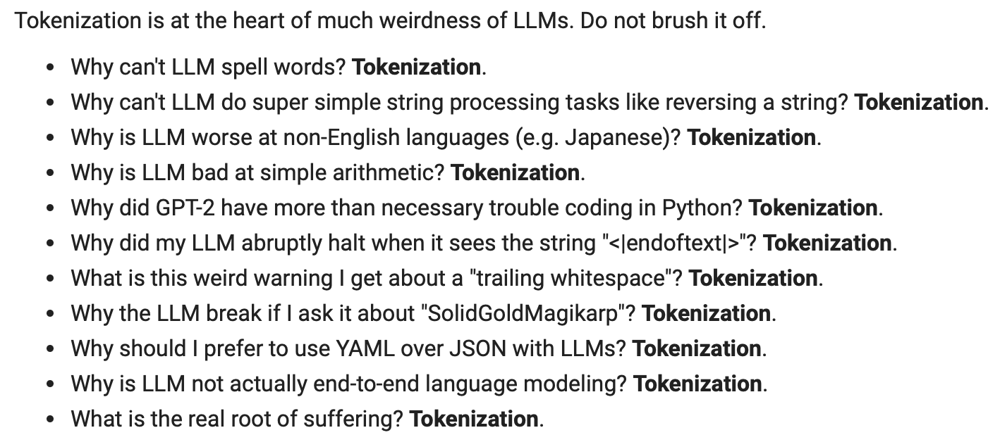

# 🧬 Medical BPE Tokenizer — From Scratch

A **Byte Pair Encoding (BPE)** tokenizer built from scratch, specifically designed for **medical text** using the [PubMed Summarization](https://huggingface.co/datasets/ccdv/pubmed-summarization) dataset.

> *"Tokenization is at the heart of much weirdness of LLMs. Do not brush it off."* — Andrej Karpathy



> **Note:** This is an experimental project. The tokenizer was trained on a **small sample** of the PubMed dataset to explore domain-specific BPE. With a larger corpus, we'd expect significantly better compression and vocabulary coverage for medical terminology.

---

## 🎯 Why a Medical Tokenizer?

General-purpose tokenizer are trained on web text and **waste tokens** on medical terminology. A domain-adapted tokenizer means **better compression**, **fewer tokens per document**, and **more efficient LLM training** on medical data.

**Example:** The word "gastrointestinal" takes 3 tokens in general tokenizer but just 1 token in our medical tokenizer.

---

## ✨ Key Features

- **Medical-aware pretokenization regex** — preserves medical terms as atomic units
- **Greek letter & symbol normalization** — `α → alpha`, `β → beta`, `± → +/-`, `≥ → >=`
- **LaTeX & HTML entity cleanup** — strips LaTeX commands, decodes HTML entities
- **Data quality filtering** — rejects DNA/protein sequences, requires medical keyword presence
- **Heap-optimized BPE training** — lazy-deletion max-heap with compaction for efficient merges
- **Inverted index** (`pair_to_words`) — only updates affected words during each merge
- **Deterministic tie-breaking** — `ReversedBytes` ensures reproducible merge order on frequency ties

---

## 📁 Project Structure

```
├── medical_tokenizer.py          #tokenizer code
├── medical_tokenizer.ipynb       # Notebook
├── tokenization_types.ipynb      # word vs char vs subword tokenization
├── results/
│   ├── vocab.pkl            
│   ├── merges.pkl            
├── input.txt                    
├── requirements.txt      
```

---

## 🚀 Quick Start

### Prerequisites

```bash
pip install -r requirements.txt
```

### 1. Generate the Corpus (one-time)

```python
from medical_tokenizer import *
from datasets import load_dataset

ds = load_dataset("ccdv/pubmed-summarization", split="train[:10%]")
create_filtered_medical_corpus(ds, "pubmed_filtered_corpus.txt")
```

This downloads ~10% of PubMed abstracts, filters out non-medical content (DNA sequences, junk), normalizes text, and writes a clean ~200 MB corpus.

### 2. Train the Tokenizer

```python
from medical_tokenizer import *

vocab, merges = train_medical_bpe_tokenizer(
    input_path="pubmed_filtered_corpus.txt",
    vocab_size=32_000,
    use_medical_regex=True,
)
```

### 3. Use the Tokenizer

```python
from medical_tokenizer import *

tokenizer = MedicalBPETokenizer("./results")

# Encode
ids = tokenizer.encode("The patient was treated with IL-6 inhibitors for rheumatoid arthritis.")
print(ids)  

# Decode 
text = tokenizer.decode(ids)
print(text)
```

---

## ⚡ Optimization Journey

The BPE training algorithm went through several iterations:

| Approach | Description | Limitation |
|---|---|---|
| **Naive** | Scan all pairs every merge | O(n) per merge — too slow for large corpus |
| **Incremental pairs** | Only recount affected pairs | Still rescans too many words |
| **Inverted index** | `pair_to_words` maps pairs → word IDs | Fast lookup, but finding best pair is O(pairs) |
| **Heap + inverted index** ✅ | Max-heap with lazy deletion + compaction | O(log n) best-pair lookup — final approach |

The final approach trains **31,743 merges in ~3 minutes** on 200 MB of text.

---

## 🏗️ Architecture

### Pipeline Overview

```
PubMed Dataset
    │
    ▼
┌──────────────────────┐
│  Data Filtering      │  
│  Text Normalization  │ 
└──────────────────────┘
    │
    ▼
┌──────────────────────┐
│  Pretokenization     │  Medical-aware regex splitting
│  (byte-level)        │ 
└──────────────────────┘
    │
    ▼
┌──────────────────────┐
│  BPE Training        │  Heap-based merge loop with inverted index
│  32,000 merges       │ 
└──────────────────────┘
    │
    ▼
┌──────────────────────┐
│  Tokenizer Class     │  encode() / decode() with merge ranking
│  (MedicalBPETokenizer)│
└──────────────────────┘
```

## 📓 Notebook

`tokenization_types.ipynb` demonstrates the three main tokenization approaches:

1. **Word-based** — simple whitespace/regex splitting
2. **Character-based** — individual character tokens
3. **Subword-based (BPE)** — the sweet spot between word and character level

---

## 📊 Training Stats

| Metric | Value |
|---|---|
| Corpus size | ~200 MB (PubMed 10% split) |
| Initial vocab | 257 (256 bytes + 1 special token) |
| Final vocab | 32,000 tokens |
| Merges performed | 31,743 |

## 🔗 References & Acknowledgments

1. [Sebastian Raschka — BPE from Scratch](https://sebastianraschka.com/blog/2025/bpe-from-scratch.html)
2. [Building a Fast BPE Tokenizer from Scratch](https://jytan.net/blog/2025/bpe/)
3. [Andrej Karpathy — Let's build the GPT Tokenizer](https://youtu.be/fKd8s29e-l4?si=zOHCbc1fWFSZJneO)
4. [Karpathy's minbpe](https://github.com/karpathy/minbpe)
5. [Imad Dabbura — BPE Tokenizer](https://imaddabbura.github.io/posts/nlp/BPE-Tokenizer.html)